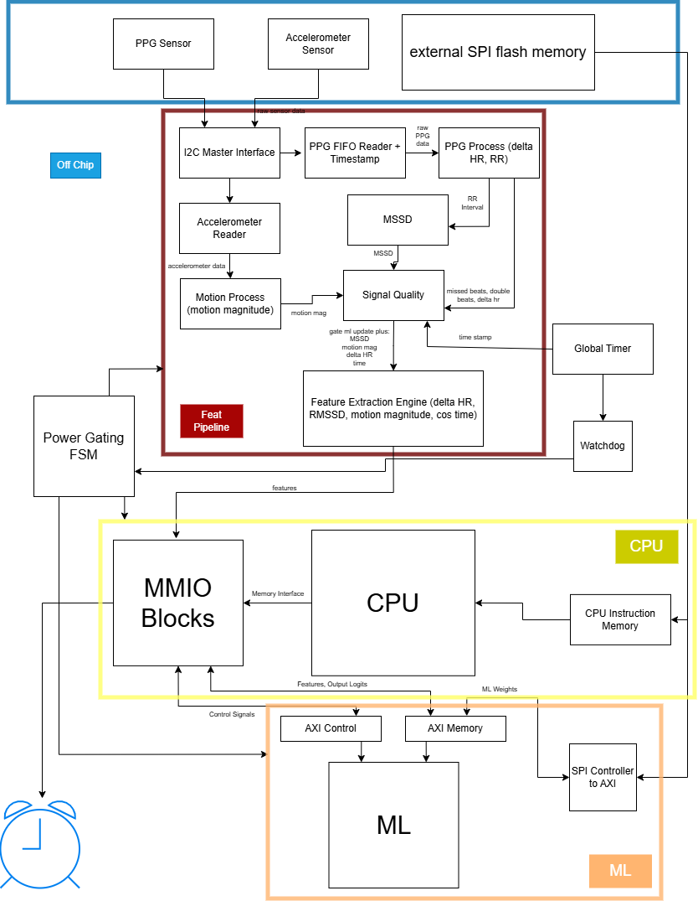
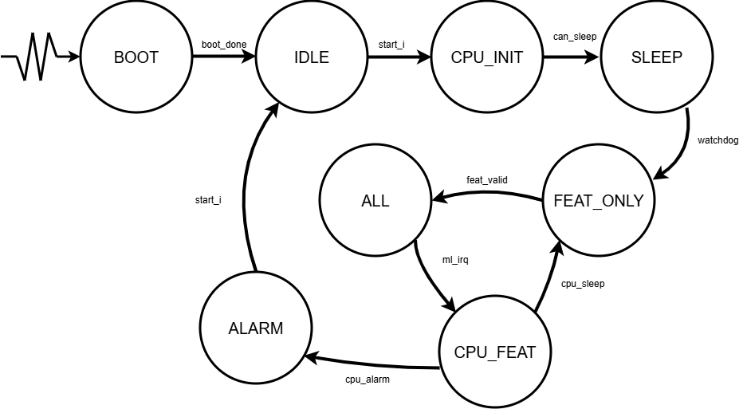

# SensorSoC

A UCSC Chip Design Capstone project by Ananya Manduva, Jackson Friday, Nathan Nakamoto, Nithin Duvvuru, Rishi Govindan, and Shane Stearns.

The goal is a custom ASIC SoC that intakes accelerometer and PPG sensor data, processes it, and feeds a lightweight three-layer MLP model that determines whether the user is in a good stage to wake (NREM/light sleep) or not (REM/deep sleep). A PicoRV32 core on chip sends a GPIO alarm signal at wake time. The chip sleeps until a watchdog timer fires, indicating it's time to check sleep states.

Fabricated on the GF180MCU process via [wafer.space](https://wafer.space) MPW runs.

## Usuage

Connecting the Chip to these 2 Sensor Models:
* [Accelerometer](https://www.st.com/en/mems-and-sensors/lis2dw12.html)
* [PPG](https://www.digikey.com/en/products/detail/analog-devices-inc/ADPD144RI-ACEZ-RL7/7932006)

The chip is intended to be worn while sleeping. Through the programmable Flash memory (referenced later as well) the user saves how long they want to sleep (set in CPU firmware) before hitting the start button. The chip will sleep until the interval has elapsed, before then using the sensor data in combination with a small ML model to make inferences on the user's sleep state without any intrusive or bulky brain wave detection. From there it decides a good time to wake the user depending on where they are in their sleep cycle.

## Design Overview

At a high level, our project:
1. Loads CPU instruction memory from the [SPI flash memory](https://www.mouser.com/new/infineon/cypress-s25fl-mirrorbit-flash/?srsltid=AfmBOopFM04QP2PCEYxch_qfuaAEGl7-i86BYyoPRtVD-AA0aJcyBhdZ), before idling itself. This flash also contains the ML weights, after boot the interface is passed off to the ML
2. After receiving the start singal, Initates a CPU boot set up to set system parameters, including time to sleep overnight
3. Sleeps until the watchdog timer signals the sleep interval has passed.
4. Using sensor data, begins to generate features for our Machine Learning Model, creating a heartrate baseline during this time as well as assembling the mothion data and Delta HR and MSSD HR for that epoch (~ 1min).
5. Once the feature for the epoch is created, the CPU is woken and writes the features into the ML, which is also woken at this time
    * Since NNGen generates a 2 way AXI interface, we also use the block weight_flash_axi, which converts the CPUs requests into AXI writes to the ML.
    * This block also serves to let the ML access its weights, converting the AXI-Lite Reads from the ML to SPI commands to the flash.
6. After the ML generates an inference based off this, it is put back to sleep
7. The CPU intakes that inference and makes a decision:
    * We've seen enough vaild wakes, signal the alarm to wake the user
    * We haven't, go back to sleep and wait for the next feature set
8. Once Alarm is reached, the wait for the user to signal the start signal again, to turn off alarm signal, then wait for the signal once again to start the next night.

## Diagrams

Below is the final block diagram we used for our Project:



As well as the Power gating State Machine we use:
 

## Directories

* `src/` - All RTL sources (SystemVerilog/Verilog)
* `cocotb/` - Simulation testbenches (cocotb + Icarus Verilog)
* `scripts/` - Utility scripts (padring flow, GDS rendering, ML model synthesis, Sesnor Model CSVs/Python Models)
* `librelane/` - LibreLane PnR configuration and slot definitions
* `ip/` - Custom IP blocks (chip ID, wafer.space logo)
* `third_party` - Outside tools taken in for the project (RISCV compilation toolchain)
* `final/` - The make librelane run from 

## Prerequisites

We use a custom fork of the [gf180mcuD PDK variant](https://github.com/wafer-space/gf180mcu) until all changes have been upstreamed.

To clone the latest PDK version, run:

```
make clone-pdk
```

Check requirements.txt for the dependencies needed.

## Generating the ML Model

The version we used is already contained within src/. To generate it as we did, in scripts/ml/:
* taketwo.py trains then generates the 3-Layer MLP as an .onnx file
* writeverilog.py generates the ML model as a netlist using [NNGen](https://github.com/NNgen/nngen), also tests the weight accessing in a testbench it writes out.
* Move the model into /src, and the weights into cocotb/sim/tb/ml for testing

From there the model is simulatable, but for synthesis, we had to replace the internal memory models it uses by hand, so it now uses the GF180MCU's memory blocks.

Install LibreLane by following the Nix-based installation instructions: https://librelane.readthedocs.io/en/latest/installation/nix_installation/index.html

## Implement the Design

This repository contains a Nix flake that provides a shell with the [`leo/gf180mcu`](https://github.com/librelane/librelane/tree/leo/gf180mcu) branch of LibreLane.

Run `nix-shell` in the root of this repository, then:

```
make librelane
```

We are using the default '1x1' slot size for our design.

## View the Design

After completion, view using the OpenROAD GUI:

```
make librelane-openroad
```

Or using KLayout:

```
make librelane-klayout
```

## Simulation

We use [cocotb](https://www.cocotb.org/) with Icarus Verilog for RTL verification. See `cocotb/README.md` for the full list of testbench targets.

To run the basic, one night test, top-level chip RTL simulation:

```
make sim
```

To run more substantial tests (multiple nights, boot test, smoke tests):

```
make sim-full
```

To rerun the current reproducible firmware smoke flow:

```
make repro-firmware-flow
```

That script initializes submodules, checks the RISC-V toolchain, rebuilds both
firmware integration images (`irq_test` and `prod_main`), then runs the DFT
smoke test, IRQ-state regression, and production firmware host-I2C/ML smoke
regression.

The reproducible setup is split into smaller Make targets:

```
make init-submodules          # git submodule update --init --recursive
make python-deps              # install requirements.txt into .venv
make check-riscv-toolchain    # verify riscv-none-elf/riscv64-unknown-elf tools
make repro-firmware-build     # rebuild irq_test and prod_main only
make repro-firmware-flow      # rebuild firmware and run smoke regressions
```

If the RISC-V GCC toolchain is vendored as a submodule, put the source at
`third_party/riscv-gnu-toolchain` and build it with:

```
git submodule update --init --recursive
make build-riscv-toolchain
```

The build installs into `third_party/riscv-toolchain`, which the firmware
scripts automatically detect. Skip `make build-riscv-toolchain` when
`make check-riscv-toolchain` already finds an external toolchain.

To run the gate-level equivalent of make sim (requires a completed LibreLane run in `final/`):

```
make sim-gl
```

View waveforms:

```
make sim-view
```

Waveform output: `cocotb/sim_build/chip_top.fst`

## Dataset

ML training data sourced from PhysioNet:

Walch, Olivia. "Motion and heart rate from a wrist-worn wearable and labeled sleep from polysomnography" (version 1.0.0). PhysioNet (2019). https://doi.org/10.13026/hmhs-py35

We adapted this feature set to end up with 4 features, time Delta HR, MSSD (Mean Square Successive Differences), and Accel Motion. After adapting, we add on the annotated Sleep stages as well from training. These end up in processed_sleep_dataset.csv in scripts/ml. After, we used the add_rtl_labels.py script to append the correct labels for the data back to the features set for ML training.

## Pinout
### Normal Mode
Standard chip behavior when

`input_in[4:0] = 5'b00000;`

#### Input Pins (12)

* `input_in[4:0]` - test mode selector
* `input_in[11:5]` - unused

#### Bidirectional IO Pins (40)

* `bidir[0]` - alarm output
* `bidir[1]` - SPI flash clock output
* `bidir[2]` - SPI flash MOSI output
* `bidir[3]` - SPI flash CS_n output
* `bidir[4]` - SPI flash MISO input
* `bidir[5]` - Start Button input
* `bidir[23]` - I2C SCL input
* `bidir[24]` - I2C SDA open drain in/out
* `bidir[22:7]` - 16-bit debug bus outputs in debug/test modes
* `bidir[37]` - force Pico IRQ input used in test modes `5'b01010` and `5'b11010`
* `bidir[38]` - force wake source input used in test modes `5'b01011` and `5'b11011`
* `bidir[39]` - external test clock input used by the `1xxxx` test-mode bank
* `bidir[36:23]` - unused

### Test Modes 

See DFT_MODE_MATRIX.md

## Results

### Sim Testing
Taking a majority of our time, `make sim` , `make sim-full`, and `make repro-firmware-flow` passes as our RTL sim tests. these tests test our chips DFT test modes, reset assertion, boot, a 1 night normal test, and a test to make sure the chip properly resets after setting alarm.

### MLP Model
Our ML model once retrained on the feature pipeline dataset, and after we had to change the feature set to reduce on feature pipeline size, experienced a drop off in accuracy, from around 85% to 75%. Most of the missed classifications are due in part to increasing the epoch size a little as well, the ML model struggled a little more to notice trends. Logits vary slightly, we believe the truncation o the weights to 16bit is largely to blame for this as well. 

### Chip Statistics
Our chip was quite bulky, utilizing around 70% of the 1x1 chip slot. We also registered a 5.91mW power usuage, without plugging in any switching statistics. If we account for the power gating our chip conducts, we believe the average power intake to be lower. We were also able to get rid of all of our timing violations through librelane, no setup or hold.

#### Cell Statistics
* 11k Sequential Cells
* 52K Combinational Cells
* 28 gf180mcu 512x8 SRAM Macros

## Limitations/Shortcomings
Due to time, we were unable to create and validate testing infrastructure for the DFT test modes in gate level, as well as an SDF back annotated version for our one night sim test. To fit the Chip slot size, we had to reduce the feature pipeline and ML model by a bit which hurts the accuracy. The conjestion/heat map for our chip is also incredibly dense, which hurts our design for noise and power consumption. Also, due to the pad ring we have XXXX Max Cap violations, as well as XXXX Slew violations due to the distribution of fsm enables, which have to drive huge signals across our chip.
Though now beyond the scope of this class, we would still like to:
* Run more through Gate Level Testing
* Make a back annotated SDF target
* Fix our Violations